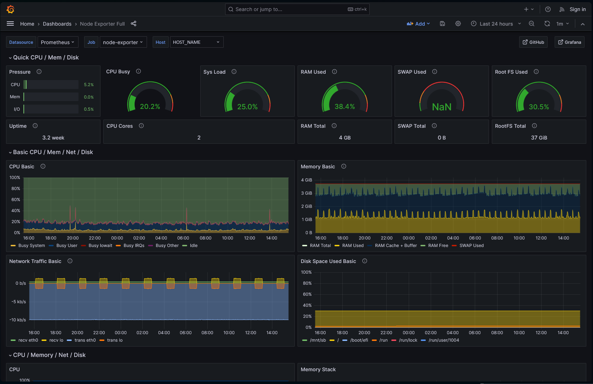

# Monitoring Setup (Both Monitoring and Client's Server)

## Overview

This repository provides a monitoring setup with instructions for both the monitoring server and the client server, enabling the collection and visualization of system metrics.

## Structure

### Monitoring

- **Node Exporter** : Scrape metrics from the system itself
- **CAdvisor** : Scrape metris from each running container
- **OpenTelemetry Collector** : Collects all the metrics from itself and from each client connected 
- **Prometheus** : Processes all the metrics 
- **Promtail** : Groups logs from all containers into one 
- **Loki** : Receives and processes the logs from promtail and the system ifself 
- **Tempo** : Processes all the traces
- **Grafana** : Visualization tool

### Client

- **Node Exporter** : Scrape metrics from the system itself
- **CAdvisor** : Scrape metris from each running container
- **OpenTelemetry Collector** : Collects all the metrics from itself and sends to the monitoring server 
- **Promtail** : Groups logs from all containers into one and sends to the monitoring server
- **Additional services** : Needed to expose metrics from certain services (Only present in some docker compose)

## Setup Instructions - Monitoring

### 1. Copy Files to Your Repository

Copy the files located inside the `monitoring` folder of this repository to the corresponding location in your repository.

### 2. Update Configuration

Create a `.env` file inside the main directory where you copied the files (If you copied the whole repo, it would be inside the `monitoring` directory).

Add the following enviornment variables:
- `HOST_NAME=<NAME_HERE>` : Specify a name for the current system, it will be used to be easily recognizable in the grafana dashboards.
- `HOST_PUBLIC_IP=<PUBLIC_IP_HERE>` : Update with the public IP address of the current system. This ensures that all the services are correctly configured to work with eachother.

### 3. Start the Monitoring Containers

To test the monitoring setup, navigate to the directory containing the `docker-compose.yml` file and execute the following command:

(If docker engine is running through docker desktop, make sure that the setting `Use containerd for pulling and storing images` is not checked)

```bash
docker compose up -d
```

This command will start the monitoring containers in detached mode.

### 4. Access the Grafana Dashboard

After running the command, the Grafana service will be open in `localhost:3000` by the docker engine.

You can access one of its dashboards to verify that the variables are set up. 
- Home -> Dashboards -> General -> Node Exporter Full.



If your setup is correct, your `HOST_NAME` should be listed, and you should see various metrics and visualizations related to your system's performance.


## Setup Instructions - Intra

This step-by-step guide configures the "base" version of our monitoring setup.

This version contains:
- **Node Exporter** : Scrape metrics from the system itself (%CPU, %RAM, %DISK, etc.)
- **CAdvisor** : Scrape metris from each running container (%CPU, %RAM, %DISK, etc.)
- **OpenTelemetry Collector** : Collects all the metrics and sends them to the monitoring server 
- **Promtail** : Groups logs from all containers and sends to the monitoring server

### 1. Copy Files to Your Repository

Copy the files located inside the `client` folder of this repository to the corresponding location in your repository.

The important files are:
- `docker-compsoe-simple.yml` : The docker compose file that will be used
- `configs/otel-collector-config-simple.yaml` : OpenTelemetry Collector's config
- `configs/promtail-config.yaml` : Promtail's config
- `.env` : File with environment variables that will be used by all of the above

### 2. Update Configuration

A `.env` file is already included in the repository. Open it and update the following environment variables:
- `HOST_NAME=<NAME_HERE>` : Specify a name for the current system, it will be used to be easily recognizable in the grafana dashboards.
- `HOST_PUBLIC_IP=<PUBLIC_IP_HERE>` : Update with the public IP address of the current system. This ensures that all the services are correctly configured to work with eachother.
- `SERVER_MONITORING_PUBLIC_IP=<PUBLIC_IP_HERE>` : (Default is 5.75.190.25 and should not be needed to change) Update with the public IP address of the monitoring system. This ensures that the metrics/traces/logs are sent to the right place.

### 3. Start the Monitoring Containers

To test the monitoring setup, navigate to the directory containing `docker-compose-simple.yml` and run:

```bash
docker compose -f docker-compose-simple.yml up -d
```
(If docker engine is running through docker desktop, make sure that the setting `Use containerd for pulling and storing images` is not checked)

This command will start the monitoring containers in detached mode.

### 4. Access the Grafana Dashboard

After running the command, the Grafana service will be open in `SERVER_MONITORING_PUBLIC_IP:3000` ([http://5.75.190.25:3000](http://5.75.190.25:3000)) by the docker engine. 

You can access one of its dashboards to verify that the variables are set up. 
- Home -> Dashboards -> General -> Node Exporter Full.


If your setup is correct, your `HOST_NAME` should be listed, and you should see various metrics and visualizations related to your system's performance.


## Setup Instructions - Client

### 1. Copy Files to Your Repository

Copy the files located inside the `client` folder of this repository to the corresponding location in your repository.

### 2. Update Configuration

A `.env` file is already included in the repository. Open it and update the following environment variables:
- `HOST_NAME=<NAME_HERE>` : Specify a name for the current system, it will be used to be easily recognizable in the grafana dashboards.
- `HOST_PUBLIC_IP=<PUBLIC_IP_HERE>` : Update with the public IP address of the current system. This ensures that all the services are correctly configured to work with eachother.
- `SERVER_MONITORING_PUBLIC_IP=<PUBLIC_IP_HERE>` : (Default is 5.75.190.25 and should not be needed to change) Update with the public IP address of the monitoring system. This ensures that the metrics/traces/logs are sent to the right place.

### 3. Choose a Docker Compose File

There are multiple Docker Compose files inside the `client` folder, each having the same foundation but catering to various additional services that might exist.

If you want a minimal setup that scrapes metrics, traces and logs from the system and the containers running, use docker-compose-simple.yml.

Otherwise, pick the file best suited to your needs.

### 4. Start the Monitoring Containers

To test the monitoring setup, navigate to the directory containing the chosen Docker Compose file (e.g., `docker-compose-simple.yml`) and run:

```bash
docker compose -f docker-compose-simple.yml up -d
```
(If docker engine is running through docker desktop, make sure that the setting `Use containerd for pulling and storing images` is not checked)

This command will start the monitoring containers in detached mode.

### 5. Access the Grafana Dashboard

After running the command, the Grafana service will be open in `SERVER_MONITORING_PUBLIC_IP:3000` ([http://5.75.190.25:3000](http://5.75.190.25:3000)) by the docker engine. 

You can access one of its dashboards to verify that the variables are set up. 
- Home -> Dashboards -> General -> Node Exporter Full.


If your setup is correct, your `HOST_NAME` should be listed, and you should see various metrics and visualizations related to your system's performance.

## Important Notes

- **Monitoring for each client instance:** The steps outlined above must be followed for each individual instance that needs to be monitored. Each one will then send its metrics to the central monitoring server.
  
- **Data Storage:** The Grafana dashboard will display and store metrics and visualizations for all monitored hosts. This data will be automatically monitored and stored on the server, allowing for later analysis and reporting.


